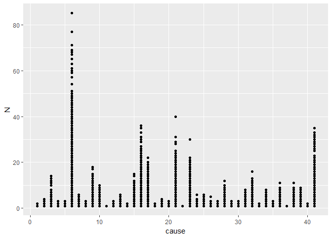

長庚大學 大數據分析方法 作業六
================

資管四甲 B0244143 張芳瑀 \#\# 分析議題背景

現代科技進步，但每天還是有許多人死去，不管男女老少，因各種原因沒了生命，藉由統計的數據去做分析。

分析動機
--------

科技日新月異，醫療設備、技術也跟著進步，在這21世紀當中，看似每個人都應該活得長壽健康，但卻不是每個人都如此，還是有人死於病痛或者其他原因，想藉由這份資料來探討分析。

使用資料
--------

政府資料開放平台的死因統計，

載入使用資料們

``` r
library(readxl)
```

    ## Warning: package 'readxl' was built under R version 3.3.3

``` r
library(readr)
```

    ## Warning: package 'readr' was built under R version 3.3.3

``` r
#欄位說明
data.xls1<-read_excel("C:/Users/Fangyu/Desktop/全死因/col.xls",1)
View(data.xls1)
data.xls2<-read_excel("C:/Users/Fangyu/Desktop/全死因/col.xls",2)
View(data.xls2)
data.xls3<-read_excel("C:/Users/Fangyu/Desktop/全死因/col.xls",3)
View(data.xls3)
data.xls4<-read_excel("C:/Users/Fangyu/Desktop/全死因/col.xls",4)
View(data.xls4)
data.xls5<-read_excel("C:/Users/Fangyu/Desktop/全死因/col.xls",5)
View(data.xls5)


#各年死因統計
data1<-read_csv("C:/Users/Fangyu/Desktop/全死因/dead100.csv")
```

    ## Parsed with column specification:
    ## cols(
    ##   year = col_integer(),
    ##   county = col_integer(),
    ##   cause = col_integer(),
    ##   sex = col_integer(),
    ##   age_code = col_integer(),
    ##   N = col_integer()
    ## )

``` r
View(data1)
data2<-read_csv("C:/Users/Fangyu/Desktop/全死因/dead101.csv")
```

    ## Parsed with column specification:
    ## cols(
    ##   year = col_integer(),
    ##   county = col_integer(),
    ##   cause = col_integer(),
    ##   sex = col_integer(),
    ##   age_code = col_integer(),
    ##   N = col_integer()
    ## )

``` r
View(data2)
data3<-read_csv("C:/Users/Fangyu/Desktop/全死因/dead102.csv")
```

    ## Parsed with column specification:
    ## cols(
    ##   year = col_integer(),
    ##   county = col_integer(),
    ##   cause = col_integer(),
    ##   sex = col_integer(),
    ##   age_code = col_integer(),
    ##   N = col_integer()
    ## )

``` r
View(data3)
data4<-read_csv("C:/Users/Fangyu/Desktop/全死因/dead103.csv")
```

    ## Parsed with column specification:
    ## cols(
    ##   year = col_integer(),
    ##   county = col_integer(),
    ##   cause = col_integer(),
    ##   sex = col_integer(),
    ##   age_code = col_integer(),
    ##   N = col_integer()
    ## )

``` r
View(data4)
data5<-read_csv("C:/Users/Fangyu/Desktop/全死因/dead104.csv")
```

    ## Parsed with column specification:
    ## cols(
    ##   year = col_integer(),
    ##   county = col_integer(),
    ##   cause = col_integer(),
    ##   sex = col_integer(),
    ##   age_code = col_integer(),
    ##   N = col_integer()
    ## )

``` r
View(data5)
```

資料處理與清洗
--------------

1.判斷資料型別2.將有NA的資料移除

處理資料

``` r
class(data.xls1)
```

    ## [1] "tbl_df"     "tbl"        "data.frame"

``` r
class(data.xls2)
```

    ## [1] "tbl_df"     "tbl"        "data.frame"

``` r
class(data.xls3)
```

    ## [1] "tbl_df"     "tbl"        "data.frame"

``` r
class(data.xls4)
```

    ## [1] "tbl_df"     "tbl"        "data.frame"

``` r
class(data.xls5)
```

    ## [1] "tbl_df"     "tbl"        "data.frame"

``` r
class(data1)
```

    ## [1] "tbl_df"     "tbl"        "data.frame"

``` r
class(data2)
```

    ## [1] "tbl_df"     "tbl"        "data.frame"

``` r
class(data3)
```

    ## [1] "tbl_df"     "tbl"        "data.frame"

``` r
class(data4)
```

    ## [1] "tbl_df"     "tbl"        "data.frame"

``` r
class(data5)
```

    ## [1] "tbl_df"     "tbl"        "data.frame"

``` r
data1<-data1[complete.cases(data1),]
data2<-data2[complete.cases(data2),]
data3<-data3[complete.cases(data3),]
data4<-data4[complete.cases(data4),]
data5<-data5[complete.cases(data5),]
```

探索式資料分析
--------------

由圖可知病因06為104年全台主要死因，再參考對照表得知06是惡性腫瘤。

``` r
library(data.table)
data104<-data.table(data5)
data104[,.(Number=sum(N)),by=cause]
```

    ##     cause Number
    ##  1:     2    571
    ##  2:     3   3428
    ##  3:     4    335
    ##  4:     6  46829
    ##  5:     7   1386
    ##  6:     9   9530
    ##  7:    10   1368
    ##  8:    13   1060
    ##  9:    15   5536
    ## 10:    16  19202
    ## 11:    17  11169
    ## 12:    18     61
    ## 13:    19    748
    ## 14:    21  10761
    ## 15:    22     16
    ## 16:    23   6383
    ## 17:    24    191
    ## 18:    25    589
    ## 19:    26    554
    ## 20:    28   4688
    ## 21:    29    386
    ## 22:    30    586
    ## 23:    31   1624
    ## 24:    32   4762
    ## 25:    34    419
    ## 26:    35    334
    ## 27:    36   1440
    ## 28:    37     32
    ## 29:    38   7033
    ## 30:    39   3675
    ## 31:    40    192
    ## 32:    41  17287
    ## 33:     1    133
    ## 34:     5    131
    ## 35:     8    275
    ## 36:    11     81
    ## 37:    12    115
    ## 38:    14     74
    ## 39:    20    184
    ## 40:    27    381
    ## 41:    33     25
    ##     cause Number

``` r
library(ggplot2)
```

    ## Warning: package 'ggplot2' was built under R version 3.3.3

``` r
ggplot(data104,
       aes(x= cause,
           y= N)) +
  geom_point()
```



期末專題分析規劃
----------------

期末專題要做死因跟年齡與性別的交叉分析
